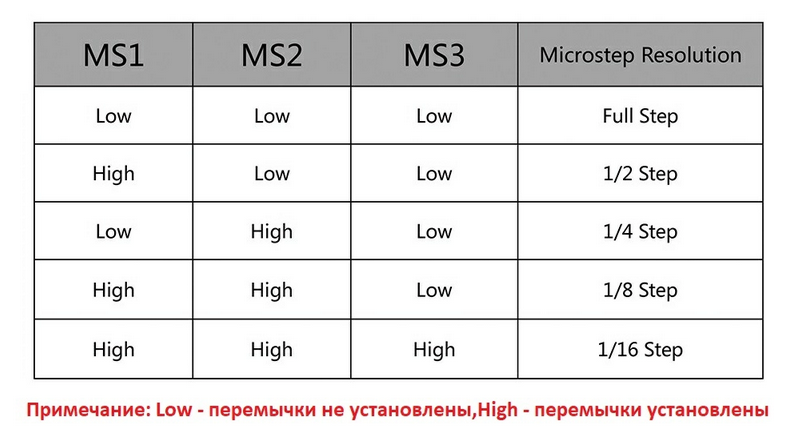

# Документация к коду
обе программы, мне кажется, будет удобно писать через классы. Да, их мало кто из нас знает, но они хорошо читаются.
при желании можно от них отказаться, документация по идее останется верной.

## TO-DO
 - [x] вместо отдельных отдельных переменных для углов, хранить массивы
 - [x] сделать коды для: тестов моторов ( чтобы понять, как какой мотор работает)
 - [ ] прохождение по всем углам в спутнике
 - [ ] прохождение микроуглов
 - [ ] микроуглы

## info
чтобы всегда не возвращаться в (0;0), алгоритм вычисляет смещение, на которое нужно переехать. вот картинка

тут вектор а - текущее положение, вектор b - требуемое, с - требуемое смещение. я в уме не смог вычислить, как его найти, поэтому нарисовал эту картинку.

### шаговый мотор 
микрошаги

